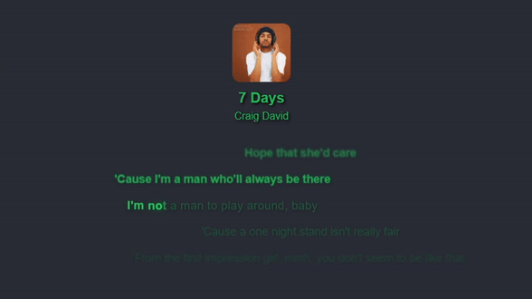

<div align="center">
    
</div>

<div align="center">


<h3>
    A cross-platform lyrics display app with karaoke-style word-by-word highlighting and floating overlay support.
</h3>


&nbsp;&nbsp;&nbsp;&nbsp;


</div>

---

## Download & installation

If you just want to use the app, you can download the latest release directly from
the [Releases](https://github.com/marioded/lyricsdisplay/releases) page.

### 📱 Android

1. Go to the **Releases** page and download the latest `.apk` file
2. Open the downloaded file on your phone
3. You may be prompted to "Allow installation from unknown sources" in your Android settings
4. Open the app, grant the requested permissions (required to read what song is playing) and enjoy!

### 💻 Desktop

1. Go to the **Releases** page.
2. Download the installer for your operating system
3. Install and launch the app. It will automatically detect the music you're currently playing. To open the **settings
   window**, click the **middle mouse button (mouse wheel)** on any text displayed by the app.

---

## Features

- **Universal sync**: automatically detects the music playing on your device (Spotify, Apple Music, Chrome, etc.).
- **Karaoke mode**: smooth, animated word-by-word or line-by-line synchronization based on different providers.
- **Floating overlay**: a persistent, draggable window to display lyrics on top of other apps.
- **Premium aesthetics**: dynamic color themes and smooth animations.
- **Always on top**: keep your lyrics pinned above your other windows while you work or game.

---

## 💻 For developers: building from source

This project uses a modern monorepo to share core logic and for code reuse across completely different platforms.

### Architecture

```text
lyricsdisplay/
├── apps/
│   ├── desktop/      # Tauri + React + Vite
│   └── mobile/       # React Native
│
├── packages/
│   ├── shared/       # Shared business logic, zustand stores, API fetchers
│   └── ui-core/      # Shared styling utilities, layout metrics, string parsing
```

### Prerequisites

- [Node.js](https://nodejs.org/) (v18+)
- [Rust](https://www.rust-lang.org/) (for desktop development)
- [Android Studio](https://developer.android.com/studio) (for mobile development)

### Setup & installation

Clone the repository and install dependencies from the root directory:

```bash
git clone https://github.com/marioded/lyricsdisplay.git
cd lyricsdisplay
npm install
```

This is a npm workspaces monorepo so you can run commands from the root directory, and they will be executed in the
correct workspace.

### 🖥️ Running the desktop app

```bash
cd apps/desktop
npm run tauri dev
```

### 📱 Running the mobile app (Android)

```bash
cd apps/mobile
npm run android
```

*Note: ensure to have an Android emulator running or a physical device connected to adb.*

*To build an APK for testing, run `.\gradlew assembleDebug` or `assembleRelease` inside the `apps/mobile/android`
directory.*

---

## Contributing

Contributions, issues, and feature requests are welcome! Feel free to check
the [issues page](https://github.com/marioded/lyricsdisplay/issues).

## License

This project is licensed under the MIT License. See the LICENSE file for details.